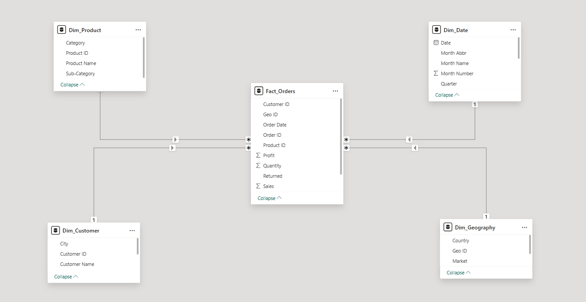
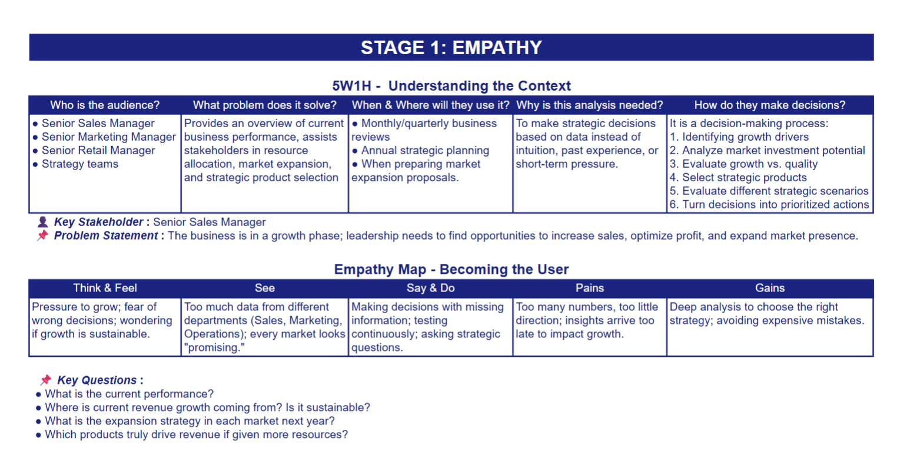
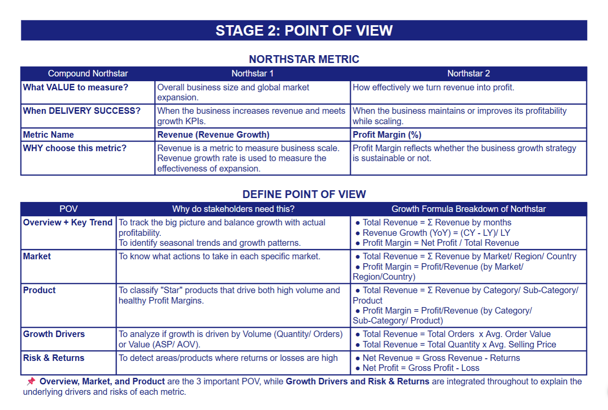
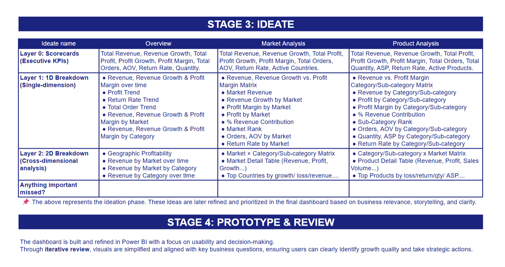

# Revenue Growth and Market Expansion Strategy in Global Superstore | Power BI

## Table of Contents  
1. [📌 Background & Overview](#-background--overview)  
2. [📂 Dataset Description & Data Structure](#-dataset-description--data-structure)  
3. [🧠 Design Thinking Process](#-design-thinking-process)  
4. [💡 Key Insights & Visualizations](#-key-insights--visualizations)  
5. [🔎 Final Conclusion & Recommendations](#-final-conclusion--recommendations)

## 📌 Background & Overview  

### What is this project about? 

🔥 Superstore is a global business with many markets. The business is experiencing strong revenue growth across global markets. However, early signals show declining profit efficiency and inconsistent performance across markets and products.

This project develops a strategic dashboard to analyze current performance and support decision-making for the upcoming year.

🎯 This dashboard is designed to answer three critical business questions:

- What is the current performance of Superstore?

- What is the expansion strategy in each market next year?

- Which products should be prioritized for strategic growth?

### 👤 Who is this project for?  

- Senior Managers evaluate business performance to drive next year’s strategic decisions.
  
- Marketing and sales teams monitor performance to adjust plans and tactical actions.

- Data analysts & business analysts extract insights to support and validate strategic choices.

## 📂 Dataset Description & Data Structure  

### Data Source  
- Source: Kaggle
- Size: 51,290 rows in Orders table

### Data Structure 
- The dataset consists of three tables: Orders, Returns, and People
  

  
Table Orders: Contains detailed transaction data on customers, products, sales, and profit 

  
| Column Name | Data Type | Description |
|---|---|---|
| Order ID | VARCHAR | Unique identifier for each order |
| Order Date | DATE | Date when the order was placed |
| Ship Date | DATE | Date when the order was shipped |
| Ship Mode | VARCHAR | Shipping method (e.g. Standard Class, First Class) |
| Customer ID | VARCHAR | Unique identifier for each customer |
| Customer Name | VARCHAR | Full name of the customer |
| Segment | VARCHAR | Customer segment (e.g. Consumer, Corporate, Home Office) |
| City | VARCHAR | City of the delivery address |
| State | VARCHAR | State or province of the delivery address |
| Country | VARCHAR | Country of the delivery address |
| Postal Code | FLOAT | Postal/ZIP code of the delivery address |
| Market | VARCHAR | Regional market (e.g. US, EU, APAC) |
| Region | VARCHAR | Geographic region within the market |
| Product ID | VARCHAR | Unique identifier for each product |
| Category | VARCHAR | Product category (e.g. Furniture, Technology, Office Supplies) |
| Sub-Category | VARCHAR | Product sub-category |
| Product Name | VARCHAR | Full name of the product |
| Sales | FLOAT | Revenue generated from the order |
| Quantity | INTEGER | Number of product units in the order |
| Profit | FLOAT | Profit earned from the order |

  
 Table Returns: Stores data on returned orders.

  
| Column Name | Data Type | Description |
|---|---|---|
| Returned | VARCHAR | Return status of the order (value: "Yes" or "No") |
| Order ID | VARCHAR | Identifier of the returned order, links to the Orders table |

  
 Table People: Holds information about sales representatives by region

  
| Column Name | Data Type | Description |
|---|---|---|
| Person | VARCHAR | Name of the sales representative |
| Region | VARCHAR | Region that the sales representative is responsible for |

### Data Relationships

## 🧠 Design Thinking Process  

1️⃣ Empathize  2️⃣ Define point of view  3️⃣ Ideate  4️⃣ Prototype and review  

## 💡 Key Insights & Visualizations  

#### I. Overview

📌 Key Findings:   

1. Business Performance in 2014
- Revenue reached $4.30M, a significant increase of +26.3% YoY. Strong revenue growth.
- Profit increased +23.9% YoY to $504K. Profit is growing slower than revenue, indicating declining efficiency.
- Orders increased +26.9%. Growth is volume-driven not value-driven (AOV slightly declined)
- Profit margin decreased by -1.87% YoY. This shows that margin pressure during revenue growth.
- Return rate decreased by -3.6% YoY, but remains high at 4.55% and needs attention.
  
2. Long-Term Trend (2011–2014)
- Revenue grew steadily from $2.3M (2011) to $4.3M (2014). Profit followed a similar trend (from $0.2M to $0.5M)
- Margin remains relatively stable (~11–12%) but drops in 2014
  
&nbsp; **Insight**:  The business has a stable growth foundation, but margin decline signals early inefficiency -> future growth must balance volume expansion with margin control

3. Seasonality (Monthly 2014)
- Revenue was highest in November ($0.56M) and lowest in February ($0.18M)
- YoY Revenue positive in all months (~+10-48%)
- Margin peaked early (March ~14.2%) but decreased during the high-growth Q4 period. 
- Return rate was highest (5.71%) in  February (the month with the lowest revenue, profit, and orders). 

 &nbsp; **Insight**: Business is seasonal, with Q4 driving revenue but lowering margin → requires careful promotion control in Q4.

4. Geographic Profitability
- Global presence in 138 countries, but 30 countries are reporting losses.
- Losses are concentrated in EMEA and LATAM, contributing nearly half of loss countries and over 50% of total losses
  
&nbsp; **Insight**: Expansion is wide but not efficient → need stronger control on market profitability.

5. Market in Revenue, Revenue Growth, and Profit Margin
- EMEA has the highest revenue growth (+47.4%) but the lowest margin (7.49%)
- APAC has the highest revenue ($1.21M) but below-average margin (11.62%)
- Canada has the smallest revenue ($0.02M) but the highest margin (25.88%)
- EU is the most stable ($1.04M Revenue, 12.37% Margin)

&nbsp; **Insight**: Performance gaps across markets are significant → a standardized strategy is ineffective

6. Category in Revenue, Revenue Growth, and Profit Margin
- Technology has the highest revenue ($1.6M) and the highest margin (14.5%)
- Office Supplies has the highest growth (+29.2%) and a high margin (13.8%)
- Furniture has the lowest margin (6.5%)
  
&nbsp; **Insight**: Growth is driven by high-margin categories (Technology, Office Supplies), while Furniture reduces overall profitability.

#### II. Market Analysis

📌 Key Findings:   
1. Revenue distribution by Market
- Based on Pareto analysis, categorizing markets into two groups: Core (APAC, EU, US, LATAM) and Small (EMEA, Africa, Canada)
- 4 Core markets contribute 85.9% of total revenue
  
&nbsp; **Insight**: Growth strategy should prioritize core markets where most revenue is generated

2. Growth vs Profitability Matrix
- Apply the matrix for 2 groups: core and small market
- Markets are segmented into 8 actionable strategic groups based on Market Tier, Revenue Growth, and Profit Margin (2×2×2 framework)

Proposed Framework

  
|Market Tier| Revenue Growth| Profit Margin| Market Strategy|
|---|---|---|---|
|Core|High|High|DOMINATE|
|Core|High|Low|FIX MARGIN|
|Core|Low|High|RE-IGNITE|
|Core|Low|Low|RESTRUCTURE|
|Small|High|High|INCUBATE|
|Small|High|Low|VALIDATE|
|Small|Low|High|MAINTAIN|
|Small|Low|Low|MONITOR|

2. Return rate by market
- Core markets show higher return rates, while small markets report 0%
- EU: lowest orders in core (1,538) but highest return rate (6.5%). APAC: highest orders (1,885) but lowest return rate in core(5.04%)

3. Top growth or top loss countries
- Top 1 growth: Qatar (+18,000% revenue, margin 22.6%) — an unusually high surge. Notably, the 6th highest growth still exceeds +1,800%
- Top 1 loss: -$30.5K profit on $33.6K revenue (margin -90.7%). The top 6 loss-making countries contribute over 60% of total losses

&nbsp; **Insight**: Extreme growth is likely non-sustainable or driven by a low base → requires careful validation. For loss-making countries, prioritize fixing or exiting these countries.

4. Profit Margin by Market and Category
- Canada has the highest margin in both 3 Categories (>20%).
- Most markets have highest margin in Technology and lowest in Furniture
- EMEA has a low margin in all 3 categories, the highest in Technology with only 11% (< Avg overall 11.73%)

&nbsp; **Insight**: Identify the top-performing categories within each market to scale up. EMEA requires further review due to consistently low margins

### ➡️ Market Strategy and Next Actions

The following next actions aim to drive revenue growth by optimizing product mix and reviewing underperforming countries, with a priority on scaling core markets

| Market | Strategy | Next Actions |
|--------|----------|--------------|
| EU | DOMINATE | Scale high-margin products; optimize product mix; reduce returns; review underperforming countries |
| US | RE-IGNITE | Shift away from low-margin Furniture; scale high-margin products; increase AOV through bundling and upsell |
| APAC | RESTRUCTURE | Improve product mix toward higher-margin; optimize pricing and discounting; review underperforming countries |
| LATAM | RESTRUCTURE | Simplify product portfolio; reduce low-margin products; apply selective price increases; review loss concentration |
| EMEA | VALIDATE | Improve product mix and pricing; focus on profitable SKUs; review loss concentration before scaling |
| Africa | MAINTAIN | Maintain efficient operations; selectively expand high-margin products |
| Canada | MAINTAIN | Maintain niche positioning; focus on profitability |

#### III. Product Analysis

📌 Key Findings:   

1. Pareto Analysis
- 8 sub-categories drive 80% of revenue 
- 4/4 sub-categories of Technology in this group

2. Tables Crisis
- The only loss-making sub-category (-$30.55K in 2014)
- Margin -12.5% → main reason dragging Furniture
- High return rate (6.32%)
- Losses over 4 years (total > $60K)
- Losses in 5/7 markets -> indicates poor product-market fit

&nbsp; **Insight**: Tables is a big problem -> requires urgent action: pricing reset, cost review, or remove

3. BCG Matrix 
- Stars: Phones, Copiers (High Revenue, High Margin)
- Question Mark: Paper, Arts (Low Revenue, High Margin)
- Cash Cows: Accessories, Storage (High Revenue, Low Margin)
- Dogs: Tables, Binders, Supplies (Low Revenue, Low Margin)

&nbsp; **Insight**: Growth should be driven by scaling Stars, improving the margin of Cash Cows, and fixing or removing Dogs

4. Sub-Category x Market and Top 10 Products
- Identify product-market fit by evaluating top-performing products in each market
- Top 10 products by revenue, quantity, ASP, return rate

&nbsp; **Insight**: Optimize product mix, apply cross-sell and upsell strategies

## 🔎 Final Conclusion & Recommendations 

- Revenue is growing strongly but profitability is declining
- Growth is concentrated in a few core markets and categories
- Loss countries and low-performing products require fix or exit 

### 🔥 Final Strategic Statement

“Sustainable growth should be driven by scaling high-performing markets and products, while improving margin quality and managing smaller markets as strategic options rather than primary growth drivers.”

### 🚀 Next actions

| Stop the bleeding (Short-term) | Fix profitability (Mid-term) | Scale what works (Long-term) |
|---|---|---|
| - Exit or control loss-making countries (e.g., Turkey, Nigeria) - Take immediate action on Tables (repricing, cost review, or discontinue) - Audit EMEA (low margins across all categories despite high growth) | - Rationalize Dog sub-categories (Tables, Binders, Supplies) - Improve return rates (especially in core markets) to protect margins - Optimize pricing strategy to reduce margin erosion | - Scale core markets with tailored strategies (Dominate, Re-ignite, Restructure) - Scale Star sub-categories (Phones, Copiers, Appliances, Accessories) - Increase AOV (bundling, upselling, product mix optimization) |
